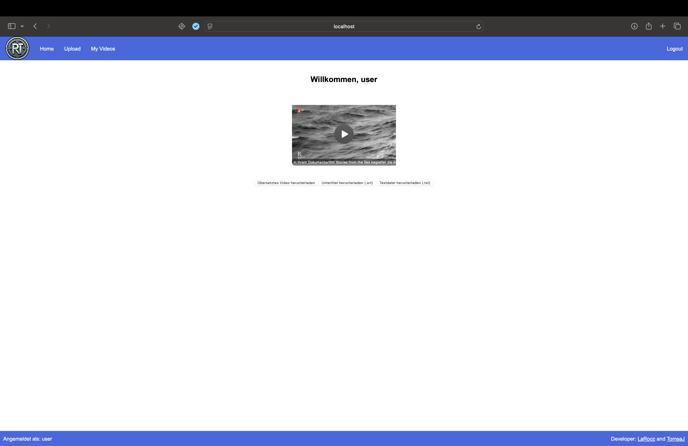
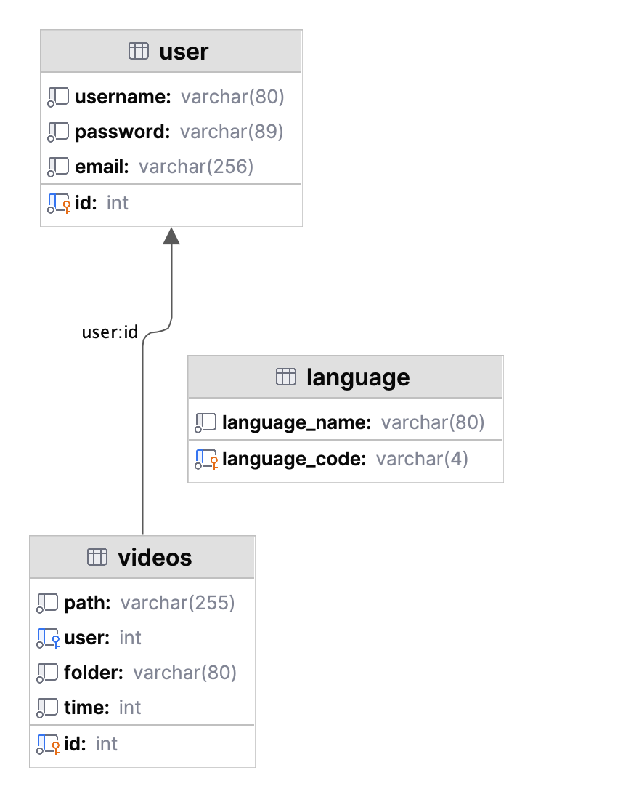

# Website-AI-VS
## Beschreibung
Das Projekt Website-AI-VS ist eine Erweiterung des Projekts [Projekt-KI-Untertitel](https://github.com/TomsaJ/Projekt-KI-Untertitel). Das Projekt [Projekt-KI-Untertitel](https://github.com/TomsaJ/Projekt-KI-Untertitel) ist eine reine Konsolenanwendung, diese in diesem Projekt Website-AI-VS zu 
einer Webanwednung umgebaute worden ist. Außerdem ist die Anwendnug erweiter worden und beinhaltet somit mehr Funktionen und Möglichkeiten.
Diese Webanwednung erstellt einen Untertitel mit dem KI-Model [Whisper](https://github.com/openai/whisper), das von OpenAI entwickelt worden ist. Es wird zum einen eine Untertitel-Datei (srt) erstellt,
die anschließend mit einem Video (mp4) zusammen kombiniert wird. Außerdem wird eine Text-Datei (txt) erstellt, in der der gesamte gesprochenen Text gespeichert wird. Die Untertitelten Videos sind im Benutzerbereich dem Untertiteln zu finden. 
 

### Version
    Aktuelle Version: v1.0

### Programmsprache

## Autor
Entwickelt wurde dieses Projekt von [LaRocc](https://www.github.com/LaRocc) und [TomsaJ](https://www.github.com/TomsaJ)

## Erweiterungsmöglichkeiten
Es gibt verschiede Punkt, die noch erweitert werden können. Beispiele für eine weitere Entwicklung sind:
### E-Mail-Mitteilungen
Der User braucht nicht durchgehend an seinem Endgeräet sitzen und warten bis das Video verarbeitet worden ist. Mit der E-Mail-Mitteilungsfunktion würde 
er ganz einfach eine E-Mail bekommen, wenn das Video fertig verarbeitet wurden.
### Modelwahl
Der User kann selber auch suchen welches Model er gerne haben mochte um sein Video zu verarbeiten.
Der Vorteil dieser Funktion würde die effizenz und benutzerfreundlichkeit sowie die Zufriedenheit erhöhen.
Das Problem dieser Funktion ist die Resourcen beanspruchung, weshalb diese Funktion nur für bestimmmte User freigeschaltet werden sollte.
Eine Liste der Module ist [hier](https://github.com/openai/whisper) zu finden.
### Gleichzeitige Mehrsprachigkeit
Zurzeit kann die Webanwendung nur in einer ausgewählten Sprache den Untertitel generieren. Eine Weiterentwicklung in diesem Bereich währe die Auswahl von mehren Sprachen gleichzeitig.
Dabei könnte mehrer Modelle gleichzeitig den Untertitel, der ausgewählten Sprachen erzeugen. Nach Abschluss der letzten Sprache, werden die Unteriteldateien der Reihe nach dem Video hinzugefügt. 

## Datenbank
Für die Webanwendung wird eine Datanbank benötigt. Diese wird beim erstellen des Docker Containers automatisch erstelle. Gleichzeigt werden die Datenbanktabelle erzeugt. In der Abblidung ist zusehen, wie die Datenbank ausgebaut ist.
  
 

Schau in die [SQL-Datei](sql/init.sql) dort kannst du die Initalesierung der Datenbank sehen.

## Lizenz
Dieses Projekt ist unter der [MIT-Lizenz](LICENSE) lizenziert - siehe die [LICENSE](LICENSE)-Datei für weitere Details.
